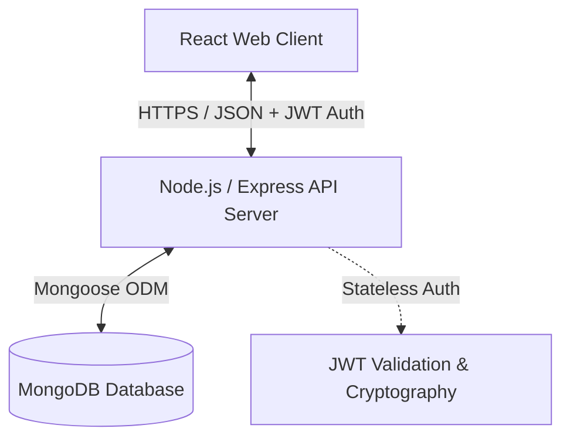

# RepoHub - Full Stack GitHub Dataset Explorer 🚀

RepoHub is a full-stack, production-grade application designed for browsing, searching, analyzing, and managing a large-scale GitHub code dataset. It features a high-performance **Express 4 & MongoDB** RESTful API coupled with a modern, glassmorphic **React 19 & Tailwind CSS v4** dashboard interface.

---

## 🏗️ System Architecture

RepoHub follows a classic decoupled client-server architecture:



### Repository Structure
```
github_dataset_bachhav_pritesh/
├── backend/                 # Layered MVC RESTful API (Express, Mongoose)
│   ├── src/                 # Controllers, Services, Models, Routes, Middlewares
│   └── server.js            # Node entry point
├── frontend/                # SPA Client App (React, Vite, Tailwind CSS v4)
│   ├── src/                 # Components, Contexts, Pages, Libs, Hooks
│   └── index.html           # HTML5 main entry
├── postman/                 # Postman collections for endpoint testing
├── GITHUB dataset.json      # Large dataset source used for seeding MongoDB
└── README.md                # Root project workspace documentation
```

---

## ✨ Key Features

### 🌐 Frontend (RepoHub Client)
- **🌓 Adaptive Themes:** Fluid dark & light modes implemented via CSS variables and React `ThemeContext`.
- **🔍 Advanced Dataset Browser:** Live dataset catalog with filtering (by type, language, framework, category) and search capabilities.
- **🛡️ Router Guards:** Route protection via `ProtectedRoute` (locks profile details) and `GuestRoute` (directs away from auth forms).
- **🔒 OTP Recovery System:** Modern password recovery flow (forgot password OTP generation -> OTP submission for password reset).
- **💫 Fluid Transitions:** Animations and micro-interactions powered by **Framer Motion**.

### ⚙️ Backend (RepoHub REST API)
- **📊 Granular Analytics:** Sophisticated MongoDB aggregation pipelines supplying count distributions for programming languages, frameworks, AI/ML task categories, and code element types.
- **🛡️ Production Security:**
  - JWT token verification and stateless blacklisting/refreshing.
  - BCrypt password hashing (10 salt rounds).
  - Rate limiters to shield search endpoints, auth controllers, and admin routes.
- **⚡ Seeder Engine:** Automatic parsing and bulk-upload scripts to import large-scale JSON dataset files.
- **📝 Form Validation:** Request sanitization using `express-validator` to guarantee data schema integrity.

---

## 🛠️ Technology Stack

| Layer | Technologies |
|---|---|
| **Frontend Framework** | React 19, Vite 8, React Router DOM v7 |
| **Frontend State** | TanStack React Query v5 (client-side caching) |
| **Frontend Styling** | Tailwind CSS v4, Framer Motion v12, Lucide Icons |
| **Backend Runtime** | Node.js, Express 4.21 |
| **Database** | MongoDB, Mongoose 8.6 |
| **Security & Auth** | JSON Web Tokens (JWT), bcryptjs |
| **Request Validation**| express-validator, express-rate-limit |

---

## 🚀 Getting Started & Quick Start Guide

Follow these steps to spin up the entire application stack locally:

### 1. Database Setup & Seeding

1. Make sure you have **MongoDB** running locally or have an active MongoDB Atlas cluster URI.
2. Navigate to the `backend` folder:
   ```bash
   cd backend
   ```
3. Copy `.env.example` to `.env` and fill in your connection parameters:
   ```env
   PORT=5000
   MONGO_URI=mongodb://localhost:27017/github_dataset
   JWT_SECRET=your_jwt_secret_key_here
   JWT_EXPIRES_IN=1d
   ```
4. Run the seeder script to import the `GITHUB dataset.json` file into MongoDB:
   ```bash
   npm install
   npm run seed
   ```

### 2. Start the Backend API

1. In the `backend` directory, run the development server:
   ```bash
   npm run dev
   ```
2. The server will start on [http://localhost:5000](http://localhost:5000). You can check health at `/api/v1/health`.

### 3. Setup and Run the Frontend Client

1. Open a new terminal tab, navigate to the `frontend` folder:
   ```bash
   cd frontend
   ```
2. Install packages:
   ```bash
   npm install
   ```
3. Copy `.env.example` to `.env` and adjust the API URL:
   ```env
   VITE_API_URL=http://localhost:5000/api/v1
   ```
4. Start the Vite local server:
   ```bash
   npm run dev
   ```
5. Open your browser to [http://localhost:5173](http://localhost:5173) to explore the interface.

---

## 📝 API Endpoints Cheat Sheet

All HTTP responses follow a standardized success/error JSON output:

| Endpoint Route | HTTP Method | Auth Required | Description |
|---|---|---|---|
| `/api/v1/health` | `GET` | No | Server uptime check |
| `/api/v1/auth/register` | `POST` | No | Creates a new user |
| `/api/v1/auth/login` | `POST` | No | Sign-in (Rate-limited) |
| `/api/v1/auth/profile` | `GET` / `PATCH` | JWT | Reads/updates user details |
| `/api/v1/datasets` | `GET` | No | Searchable, paginated dataset list |
| `/api/v1/datasets` | `POST` | JWT | Submits a single new dataset |
| `/api/v1/datasets/:id` | `GET`/`PATCH`/`DELETE` | Mixed | Retrieve, edit, or delete datasets |
| `/api/v1/analytics/datasets/...` | `GET` | No | Distinct distributions & aggregation analytics |
| `/api/v1/search/datasets` | `GET` | No | Full-text dataset search |

For complete documentation on all endpoint parameters and payloads, refer to the [Postman API Documentation](https://documenter.getpostman.com/view/50839202/2sBXwmRDDH) or view the [Backend README](backend/README.md).